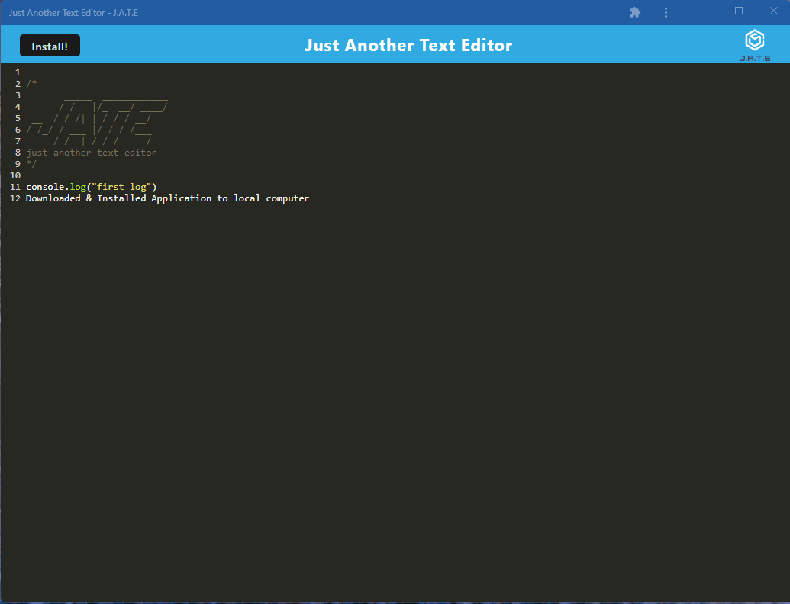

# Just Another Text Editor - J.A.T.E.

(PWA: Text-Editor)

<br>

[](https://opensource.org/licenses/MIT)
  

## Description:

A text-editor that runs in the browser. A single page application that follows the PWA standards. Features a number of data persistence techniques that serves as a redundancy in case one of the options is not supported in the browser. This application functions even without an internet connection. Built with the 'idb' npm package along with the IndexedDB API.

<br>

## User Story

```md
AS A developer I want to create or code snippets with or without an internet connection
So that I can reliably retrieve them for later use
```

<br>

## Acceptance Criteria

```md
GIVEN a text editor web application
WHEN I open my application in my editor
THEN I should see a client server folder structure
WHEN I run `npm run start` from the root directory
THEN I find that my application should start up the backend and serve the client
WHEN I run the text editor application from my terminal
THEN I find that my JavaScript files have been bundled using webpack
WHEN I run my webpack plugins
THEN I find that I have a generated HTML file, service worker, and a manifest file
WHEN I use next-gen JavaScript in my application
THEN I find that the text editor still functions in the browser without errors
WHEN I open the text editor
THEN I find that IndexedDB has immediately created a database storage
WHEN I enter content and subsequently click off of the DOM window
THEN I find that the content in the text editor has been saved with IndexedDB
WHEN I reopen the text editor after closing it
THEN I find that the content in the text editor has been retrieved from our IndexedDB
WHEN I click on the Install button
THEN I download my web application as an icon on my desktop
WHEN I load my web application
THEN I should have a registered service worker using workbox
WHEN I register a service worker
THEN I should have my static assets pre cached upon loading along with subsequent pages and static assets
WHEN I deploy to Heroku
THEN I should have proper build scripts for a webpack application
```

<br>

## Table of contents:

  * [License](#license)
  * [Heroku](#heroku)
  * [Installation](#installation)
  * [Usage](#usage)
  * [Contributions](#contributions)
  * [Author](#author)
  * [Questions](#questions)

<br>
  
## License:
<br>
      -  MIT License - Copyright (c) 2022 Jason Yoo

<br>
<br>

## Heroku:

[https://limitless-mesa-42557.herokuapp.com/](https://limitless-mesa-42557.herokuapp.com/)
  
<br>

## Installation:
<br>
      -  Click on the Heroku link provided above and install the application to your computer. 

<br>
<br>
  
## Usage: screenshots - (Highlighted Title(s) = a hyperlink to the direct image)

<br>

Once downloaded, the program will automatically be saved to your desktop with a J.A.T.E icon and will also automatically open upon the downloads completion.

<br>
  

[Screenshot1](images/Screenshot1.png)  "Heroku Website"


<br>

[Screenshot2](images/Screenshot2.png)  "Downloaded Application"



<br>
<br>

  
## Contributions:
<br>
Reach me at my email provided below to be added as a contributor.
  
<br>
<br>


## Author:
                         Jason Yoo
  

## Questions:
  For any questions regarding this application, you may reach me directly at jasonjayoo@outlook.com.

  To view my other applications, please check out my github page [jasonjayoo](https://github.com/jasonjayoo).


